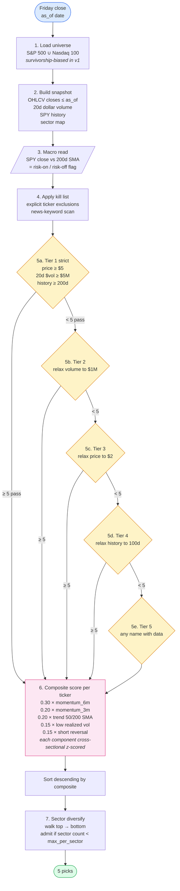

# Algorithm

Two diagrams: the **selection pipeline** (what runs every Friday close to choose 5 names), and the **weekly cadence** (when each step actually happens in calendar time). View this file on GitHub or in any modern markdown viewer to render the diagrams; an ASCII fallback follows at the bottom for terminal viewers.

---

## 1. Selection pipeline

Every Friday close, `trader.pipeline.run_pipeline(snapshot, config)` runs the seven stages below. The same code path is used by the backtester (replaying a historical snapshot) and the paper trader (using the latest snapshot).



**Notes on each stage**

| # | Stage | File | Output |
|---|---|---|---|
| 1 | Universe | `trader/universe.py` | `list[str]` of tickers |
| 2 | Snapshot | `trader/pipeline.py::Snapshot` | OHLCV panels through `as_of` only |
| 3 | Macro | `trader/macro.py` | `MacroState(risk_on, spy_close, spy_sma200)` |
| 4 | Kill list | `trader/kill_list.py` | excluded set + reasons |
| 5 | Tiered candidates | `trader/candidates.py` | DataFrame with the tier each ticker qualified under |
| 6 | Composite scoring | `trader/scoring.py` | DataFrame of components + composite |
| 7 | Sector diversify | `trader/diversify.py` | Final 5 picks |

---

## 2. Weekly cadence (calendar time)

The pipeline produces picks on Friday but doesn't act until Monday's open. The diagram below shows the sequence for one full weekly cycle, with timing relative to the typical US-equities week.

```mermaid
sequenceDiagram
    participant T as Trader<br/>(cron / GitHub Actions)
    participant P as run_pipeline
    participant B as Broker<br/>(Alpaca paper)
    participant M as Market

    Note over T,M: Sunday evening
    T->>P: Snapshot through Friday close
    P-->>T: 5 picks + tier + composite

    Note over T,M: Monday open
    T->>B: Liquidate names dropped from basket
    T->>B: Submit 5 equal-dollar market buys
    B->>M: Fill at open (+5 bps slippage)
    B-->>T: OrderResult per fill

    Note over T,M: Mon open &rarr; next Mon open
    M-->>T: Position appreciates / depreciates

    Note over T,M: Next Monday open
    T->>P: New snapshot (through previous Friday)
    P-->>T: New 5 picks
    T->>B: Liquidate held names not in new basket
    B->>M: Sell at open (-5 bps slippage)
    T->>B: Buy new names equal-dollar
    B->>M: Fill at open (+5 bps slippage)
```

Key invariants:

- The pipeline only sees prices with timestamp `<= Friday close`. No look-ahead.
- Orders submitted on Friday don't fill on Friday; they fill at Monday's open. If Monday is a holiday, the next trading session is used.
- Hold period is exactly one trading week. Names that survive into the next basket are not re-traded (no churn cost).

---

## 3. Per-ticker scoring detail

Inside stage 6, each component is computed separately, then z-scored across the surviving candidate pool, then weighted into the composite. This makes components comparable even though they have very different natural units (returns vs. volatility vs. SMA distance).

```mermaid
flowchart LR
    Closes[(Close prices<br/>candidates &times; dates)] --> M6[momentum_6m<br/><i>= close / close_126 - 1</i>]
    Closes --> M3[momentum_3m<br/><i>= close / close_63 - 1</i>]
    Closes --> Tr[trend<br/><i>= (sma_50 - sma_200) / sma_200</i>]
    Closes --> Lv[low_vol<br/><i>= -stdev(63d returns) &times; sqrt(252)</i>]
    Closes --> Sr[short_reversal<br/><i>= -(close / close_21 - 1)</i>]

    M6 --> Z1[z-score]
    M3 --> Z2[z-score]
    Tr --> Z3[z-score]
    Lv --> Z4[z-score]
    Sr --> Z5[z-score]

    Z1 -->|&times; 0.30| C[Composite]
    Z2 -->|&times; 0.20| C
    Z3 -->|&times; 0.20| C
    Z4 -->|&times; 0.15| C
    Z5 -->|&times; 0.15| C
```

The composite is the only number used for ranking; component values are still recorded on each pick (in `trades.parquet` and the paper-run JSON log) so you can later check which signals were actually responsible for which winners and losers.

---

## ASCII fallback (for terminal viewing)

```
              Friday close, as_of date
                       |
                       v
              [1. Load universe]
                       |
                       v
              [2. Build snapshot]      <-- closes <= as_of, dollar volume, SPY, sectors
                       |
                       v
              [3. Macro read]          <-- SPY close vs 200d SMA
                       |
                       v
              [4. Apply kill list]
                       |
                       v
              [5. Tiered candidates]   <-- relax progressively until >= 5 names pass
                       |
                       v
              [6. Composite score]     <-- z-scored momentum / trend / vol / reversal
                       |
                       v
              [7. Sector diversify]    <-- greedy walk, cap per sector
                       |
                       v
                  5 picks
                       |
                       v
              Monday open: equal-dollar buys
                       |
                       v
              Hold one trading week
                       |
                       v
              Next Monday open: sell, then re-run pipeline
```
